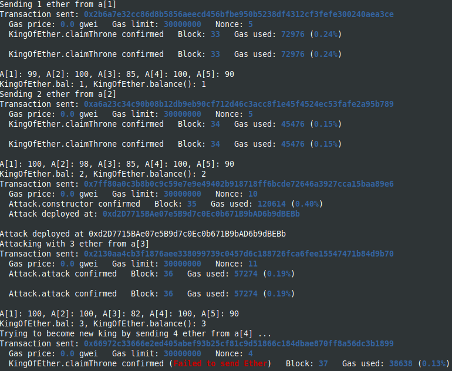
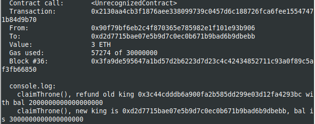

Study case of denial of service attack, from Solidity by example site [Solidity by Example, denial of service](https://solidity-by-example.org/hacks/denial-of-service/)

I use brownie with hardhat in order to deploy and use the console.log features.
You should start the hardhat node in another terminal and folder (`hh node`), then, in a terminal :

```
brownie compile
brownie run scripts/deploy.py
```

The result of deployment, stopping after the attack from a[3]



